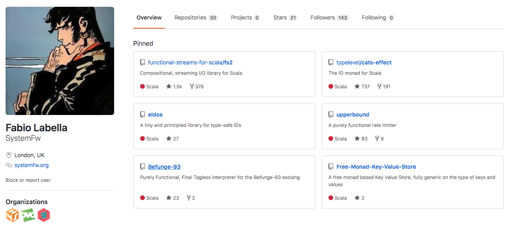

# How do Fibers work
A peek under the hood

Note:
So, what I normally do in my talks is present a general idea or
concept and develop progressive code examples around it, treating its
implementation as a black box.
I love abstraction and what it empowers us to do, but at the same time
for many engineers "how does this work?" remains one of most rewarding
questions to ask, so hopefully you will enjoy this journey into the
implementation of the lightweight threading system that powers
cats-effect and fs2.

---

<!-- .slide: data-background="img/logo.png" -->


Note:
My name is Fabio, I'm a principal software engineer at Ovo Energy, we do lots of Scala and lots of FP, so if you fancy moving to London come and talk to me after.


----

## About me



Note:
I'm also an Open source developer as SystemFw, mainly as a core maintainer of fs2 and cats-effect

---

## The big picture

```scala
def server[F[_]: Concurrent: Timer: ContextShift]:Stream[F, Unit] =
  socketGroup.server(address).map { connection =>
    Stream.resource(connection).flatMap { socket =>
      Stream
        .range(0, 10)
        .map(i => s"Ping no $i \n")
        .covary[F]
        .metered(1.second)
        .through(text.utf8Encode)
        .through(socket.writes())
        .onFinalize(socket.endOfOutput)
        .scope
      }
    }.parJoinUnbounded
     .interruptAfter(10.minutes)
```

Note:

Minimal TCP server represented as a stream of connections, emits one
element for each new connection. We then obtain the socket, and
represent the input process as another stream: we emit elements from 0
to 10, 1 per second (metered), map them to string messages, encode
them and send them through the socket. All these connections are
served concurrently (parJoinUnbounded), and after 10 minutes we
interrupt all processes (interruptAfter), making sure all the
connections shutdown gracefully (endOfOutput) before moving on. This
is compositional, and we can do something else after interrupting this
server.
In addition to offering a high level, declarative model for
concurrency including interruption and resource safety, there is
another interesting aspect to this code: it runs on a fixed number of
threads, even though we serve way more connections than available
threads, and do a lot of sleeping.

----

## Layers

- <!-- .element: class="fragment" --> **fs2**: Declarative, high
   level, safe concurrency. Many combinators and a concept of
   _lifetime_ through `Stream`.
- <!-- .element: class="fragment" --> **cats-effect typeclasses**:
   Specification for low level, foundational primitives.
- <!-- .element: class="fragment" --> **cats-effect `IO`**: Concrete
   implementation of the runtime system.

----

As a user, I highly recommend a higher level model like **fs2**'s.

<!-- .element: class="fragment" !--> But today we are _implementors_,
and we will look at the low level runtime that powers `IO`.


---

## Chapter 1: Asynchrony & Concurrency

A conceptual model

Note:
Stress how several terms like process or thread are going to be used
loosely in this section

----

## Asynchronous process

Traditionally defined as:

> A process that executes outside of the program main flow

----

## Asynchronous process

For our purposes:

> A process that continues its execution in a different place or time
  than the one it started in

Note:
Stress how "place and time" is intentionally vague

----

## Asynchronous process


Note:

An async boundary is extremely general: it could be trasfering the
computation to another node in the network, or sending it to another OS
thread, or putting it at the end of a queue where it gets picked up
later.

----

## Concurrency

Naively:

> Multiple processes executing at the same time...

<!-- .element: class="fragment" !--> ... way too wide for our purposes!

<!-- .element: class="fragment" !--> (and overlaps with parallelism)

----

## Concurrency

> A **program structuring** technique in which there are multiple
  logical threads of control, whose effects are interleaved


----

## Logical thread


A logical thread is a _sequence_ of _discrete steps_

Note:
    
This might seem obvious, but it has profound consequences.
- Discrete steps allow interleaving
- We can imagine new types of logical threads by imagining
new types of discrete steps
TODO put this point in slide about IO somewhere.

----

### Interleaving


Note:

- The notion of discrete step naturally gives rise to the notion of
  interleaving.

TODO can try
- interleaving or interleaving2 + resize image + ##interleaving
- interleaving2 + ###interleaving
- interleaving3 + ##interleaving
 

----

### M:N threading


Note:
How is the bottom layer run: segway into next slide


----

### M:N threading


----

## Threads are abstractions


> <!-- .element: class="fragment" --> 
  A logical thread offers a **synchronous** interface to an **asynchronous** process

----


----


----


----

## Blocking

> <!-- .element: class="fragment" --> 
  Blocking at one level means **suspending** at the level below.


----

Blocking pic

----

Recap


---

## Chapter 2: Real world concurrency

----
## Concurrency & parallelism

How the steps are interleaved vs how many actually run?
structuring vs running?
TODO put this into the real world concurrency section?

----


## Pictures


---

---


<!-- TODO at the end: -->
<!-- - slide nesting -->
<!-- - css: images | text -->
<!-- - css: images border -->
<!-- can use custom css on a slide-by-slide basis I think -->

<!-- Concurrency -->
<!-- Programming as the composition of independently executing processes -->
<!-- Parallelism -->
<!-- Programming as the simultaneous execution of (possibly related) computations. -->
<!-- Concurrency is about dealing with lots of things at once. -->
<!-- Parallelism is about doing lots of things at once. -->
<!-- Not the same, but related. -->
<!-- Concurrency is about structure, parallelism is about execution. -->
<!-- Concurrency provides a way to structure a solution to solve a problem that may (but not necessarily) be parallelizable. -->
<!-- In many fields, the words parallel and concurrent are synonyms; not so in programming, where they are used to describe fundamentally different concepts. -->
<!-- A parallel program is one that uses a multiplicity of computational hardware (e.g., sev‐ eral processor cores) to perform a computation more quickly. The aim is to arrive at the answer earlier, by delegating different parts of the computation to different processors that execute at the same time. -->
<!-- By contrast, concurrency is a program-structuring technique in which there are multiple threads of control. Conceptually, the threads of control execute “at the same time”; that is, the user sees their effects interleaved. Whether they actually execute at the same time or not is an implementation detail; a concurrent program can execute on a single pro‐ cessor through interleaved execution or on multiple physical processors. -->
<!-- While parallel programming is concerned only with efficiency, concurrent program‐ ming is concerned with structuring a program that needs to interact with multiple in‐ dependent external agents (for example, the user, a database server, and some external clients). Concurrency allows such programs to be modular; the thread that interacts with the user is distinct from the thread that talks to the database. In the absence of concurrency, such programs have to be written with event loops and callbacks, which are typically more cumbersome and lack the modularity that threads offer. -->
<!-- The notion of “threads of control” does not make sense in a purely functional program, because there are no effects to observe, and the evaluation order is irrelevant. So con‐ currency is a structuring technique for effectful code; in Haskell, that means code in the IO monad. -->
<!-- A related distinction is between deterministic and nondeterministic programming mod‐ els. A deterministic programming model is one in which each program can give only one result, whereas a nondeterministic programming model admits programs that may have different results, depending on some aspect of the execution. Concurrent pro‐ gramming models are necessarily nondeterministic because they must interact with external agents that cause events at unpredictable times. Nondeterminism has some notable drawbacks, however: Programs become significantly harder to test and reason about. -->


<!-- How do fibers work -->
<!-- A peek under the hood -->

<!-- Analyse the pieces: -->
<!-- - fs2 gives you compositional and safe concurrency. Many combinators -->
<!--   (as shown in the examples), and the underlying concept of lifetime -->
<!-- - cats-effect typeclasses describe a small amount of low level -->
<!--   primitives that allow to build complex concurrency models -->
<!-- - Concrete types like `IO` provide the actual implementation for the "runtime" -->

<!-- Note: -->
<!-- - As a user, I highly recommend using a higher level concurrency -->
<!--   abstraction like fs2, which is at the same time more expressive and -->
<!--   safer. -->
<!-- - But today we wear our implementors hat, and we are exclusively going to look at the cats-effect low level primitives that power the whole system. -->
<!-- - organising this functionality in typeclasses it its own topic, we are going to focus on concrete IO -->

<!-- -------- -->

<!-- IO -->
<!-- FFI - delay, async, cancelable -->
<!-- combinators: flatMap, handleErroWith, sleep, start -->
<!-- runner: unsafeRunAsync, unsafeRunSync -->
<!-- focus: async, start, sleep, unsafeRunAsync -->

<!-- --------- -->

<!-- Interlude: concurrency, asynchrony, threads -->
<!-- asynchrony -->
<!-- concurrency -->
<!-- concept of step -->
<!-- interleaving -->
<!-- thread: logical sequence over asynchrony -->
<!-- scheduling -->
<!-- cooperative vs preemptive -->
<!-- blocking/suspending -->
<!-- m:n hierarchy -->
<!-- aside: parallelism -->
<!-- cost of blocking -->
<!-- semantic blocking (thread free) -->

<!-- --------- -->

<!-- the type of async -->
<!-- Embedding async computations -->
<!-- CPS example (addition) -->
<!-- where to insert the thing about runtime loop? on top of this section? -->


<!-- --- -->

<!-- ## Api Evolution -->

<!-- **fs2** -->
<!-- -  <\!-- .element: class="fragment" -\-> 0.9 -  `Ref` via `fs2.Actor` -->
<!-- - <\!-- .element: class="fragment" -\-> 0.10 - `Ref` + `Promise` -->
<!-- -  <\!-- .element: class="fragment" -\-> 1.0 - `Ref` + `Deferred` -->

<!-- Notes: -->
<!-- - But let's start with a tiny bit of history, all the way back in fs2 0.9 there was this central datastructure, which was also called Ref, but was a much more complex beast backed by a custom Actor implementation, -->
<!-- - Then in 0.10 I redesigned our concurrency scheme, introducing basically what we have today, in the form of Ref and Promise. -->
<!-- - And finally before fs2 1.0, we decided to move Ref and Promise to cats-effect, and renamed Promise to Deferred. -->


<!-- --- -->

<!-- ## Ref[F, A] -->

<!-- -  <\!-- .element: class="fragment" -\-> Purely functional mutable reference -->
<!-- - <\!-- .element: class="fragment" -\-> Concurrent, lock-free -->
<!-- -  <\!-- .element: class="fragment" -\-> Always contains a value -->
<!-- -  <\!-- .element: class="fragment" -\-> Built on `IO` + `AtomicReference` -->

<!-- ---- -->

<!-- ## Ref api (1) -->

<!-- ```scala -->
<!-- trait Ref[A] { -->
<!--   def get: IO[A] -->
<!--   def set(a: A): IO[Unit] -->
<!-- } -->
<!-- object Ref { -->
<!--   def of[A](a: A): IO[Ref[A]] -->
<!-- } -->
<!-- ``` -->

<!-- - <\!-- .element: class="fragment" -\-> Created by giving an initial value -->
<!-- - <\!-- .element: class="fragment" -\-> Every op wrapped in `IO` for purity -->
<!-- - <\!-- .element: class="fragment" -\-> `A` is an _immutable_ structure -->
<!-- - <\!-- .element: class="fragment" -\-> Real version is polymorphic in `F` -->

<!-- Notes: -->

<!-- A Ref always has a value, and as you can see, Access, setting _and_ creation are all wrapped in IO, -->
<!-- which ensures referential transparency when encapsulating a mutable API. -->
<!-- If you find this confusing, I have a whole talk just on this -->
<!-- Real version polymorphic in F, we'll see it in a bit -->

<!-- ---- -->

<!-- ## Ref api(2) -->

<!-- ```scala -->
<!-- def report(trace: Ref[IO, List[String]], msg: String): IO[Unit] = -->
<!--   for { -->
<!--     t <- trace.get -->
<!--     _ <- trace.set(msg :: t) -->
<!--   } yield () -->
<!-- ``` -->
<!-- <\!-- .element: class="fragment" -\-> -->
<!-- ```scala  -->
<!-- def flow = for { -->
<!--   trace <- Ref[IO].of(List.empty[String]) -->
<!--   _ <- report(trace, "one").start -->
<!--   _ <- report(trace, "two").start -->
<!-- } yield () -->
<!-- ```  -->
<!-- <\!-- .element: class="fragment" -\-> -->

<!-- <\!-- .element: class="fragment" -\-> Can lose updates! -->

<!-- Note:  -->
<!-- - `start` spawns a fiber -->
<!-- - get, get, set, set loses updates -->

<!-- ---- -->

<!-- ## update -->

<!-- ```scala  -->
<!-- trait Ref[A] { -->
<!--  ... -->
<!--  def update(f: A => A): IO[Unit] -->
<!-- } -->
<!-- ```  -->
<!-- <\!-- .element: class="fragment" -\-> -->

<!-- ```scala -->
<!-- def report(trace: Ref[IO, List[String]], msg: String): IO[Unit] = -->
<!--   trace.update(t => msg :: t) -->
<!-- ``` -->
<!-- <\!-- .element: class="fragment" -\-> -->

<!-- <\!-- .element: class="fragment" -\-> Ref supports concurrent state -->

<!-- Note:  -->
<!-- - `update` is not the same as get and then set -->

<!-- ---- -->

<!-- ## Ref api(3) -->

<!-- ```scala -->
<!--   def sprinter(name: String, finishLine: Ref[IO, Int]): IO[Unit] = -->
<!--     for { -->
<!--       _ <- finishLine.update(_ + 1) -->
<!--       pos <- finishLine.get -->
<!--       _ <- IO { println(s"$name arrived at position $pos")} -->
<!--     } yield () -->
<!-- ``` -->
<!-- <\!-- .element: class="fragment" -\-> -->
<!-- ```scala  -->
<!--   def sprint = Ref[IO].of(0).flatMap { finishLine => -->
<!--     List( -->
<!--       sprinter("A", finishLine), -->
<!--       sprinter("B", finishLine), -->
<!--       sprinter("C", finishLine) -->
<!--     ).parSequence -->
<!--   } -->
<!-- ```  -->
<!-- <\!-- .element: class="fragment" -\-> -->

<!-- <\!-- .element: class="fragment" -\-> Can get wrong order! -->


<!-- Note: -->
<!-- - parSequence starts a list of `IO` concurrenty -->
<!-- - A update, B update, A get will cause issue -->

<!-- ---- -->

<!-- ## modify -->

<!-- ```scala  -->
<!-- trait Ref[A] { -->
<!--  ... -->
<!--  def modify[B](f: A => (A, B)): IO[B] -->
<!-- } -->
<!-- ```  -->
<!-- <\!-- .element: class="fragment" -\-> -->

<!-- ```scala -->
<!-- def sprinter(name: String, finishLine: Ref[IO, Int]): IO[Unit] = -->
<!--   for { -->
<!--     pos <- finishLine.modify { old => (old + 1, old + 1) } -->
<!--     _ <- IO { println(s"$name arrived at position $pos")} -->
<!--   } yield () -->

<!-- ``` -->
<!-- <\!-- .element: class="fragment" -\-> -->

<!-- <\!-- .element: class="fragment" -\-> `update` can be written in terms of `modify` -->

<!-- Note:  -->
<!-- - update can be written in terms of modify but not the other way around -->

<!-- ---- -->

<!-- ## Limitations -->

<!-- ```scala -->
<!-- trait Ref[A] { -->
<!--  ... -->
<!--  def nope(f: A => IO[A]): IO[Unit] -->
<!-- } -->
<!-- ``` -->
<!-- <\!-- .element: class="fragment" -\-> -->
<!-- ```scala -->
<!-- def update(f: A => A) = IO { -->
<!--   def loop: Unit = { -->
<!--     val oldState = atomicReference.get -->
<!--     val newState = f(oldState) -->
<!--     if (atomicReference.compareAndSet(oldState, newState)) ()  -->
<!--     else loop -->
<!--   } -->
<!--   loop -->
<!-- } -->
<!-- ``` -->
<!-- <\!-- .element: class="fragment" -\-> -->

<!-- -  <\!-- .element: class="fragment" -\-> Needs to retry `f` nondeterministically -->
<!-- - <\!-- .element: class="fragment" -\-> But gives great perf and cannot deadlock -->

<!-- Note: -->
<!-- - Needs to be able to retry `f` a nondeterministic amount of times -->
<!-- - arbitrary IOs are not idempotent -->
<!-- - Much greater perf than a lock in general -->
<!-- - Even if a thread/fiber is not executing, the others can still make progress -->
<!-- - Same applies to modify -->

<!-- --- -->

<!-- ## Deferred[F, A] -->

<!-- - <\!-- .element: class="fragment" -\-> Purely functional synchronisation -->
<!-- - <\!-- .element: class="fragment" -\-> Simple one-shot semantics -->
<!-- - <\!-- .element: class="fragment" -\-> Semantic blocking -->

<!-- ---- -->

<!-- ## Semantic blocking -->

<!-- > The fiber is waiting, but the underlying thread is free to run many other fibers -->

<!-- <\!-- .element: class="fragment" -\-> TL;DR: blocking a fiber is fine -->

<!-- ---- -->

<!-- ## Deferred api -->

<!-- ```scala -->
<!-- trait Deferred[A] { -->
<!--   def get: IO[A] -->
<!--   def complete(a: A): IO[Unit] -->
<!-- } -->
<!-- object Deferred { -->
<!--   def apply[A]: IO[Deferred[A]] -->
<!-- } -->
<!-- ``` -->
<!-- - <\!-- .element: class="fragment" -\-> A `Deferred` starts empty -->
<!-- - <\!-- .element: class="fragment" -\-> At some point it will become full -->
<!-- - <\!-- .element: class="fragment" -\-> It never becomes empty or changes again -->

<!-- ---- -->

<!-- ## Get -->

<!-- - <\!-- .element: class="fragment" -\-> on a full `Deferred`: immediately returns the value -->
<!-- - <\!-- .element: class="fragment" -\-> on an empty `Deferred`: semantically blocks until a value is available -->
<!-- - <\!-- .element: class="fragment" -\-> can be interrupted if needed -->

<!-- ---- -->

<!-- ## Complete -->

<!-- - <\!-- .element: class="fragment" -\-> on an empty `Deferred`: fills the `Deferred` and awakes the readers -->

<!-- - <\!-- .element: class="fragment" -\-> on a full `Deferred`: fails -->

<!-- ---- -->

<!-- ## Example: gate -->

<!-- ```scala -->
<!-- class Consumer { -->
<!--   def read: IO[String] -->
<!-- } -->
<!-- object Consumer { -->
<!--   def setup: IO[Consumer] // slow -->
<!-- } -->

<!-- class Producer { -->
<!--   def write: String => IO[Unit] -->
<!-- } -->
<!-- object Producer { -->
<!--   def setup: IO[Producer] // slow -->
<!-- } -->


<!-- def consumer = for { -->
<!--   c <- Consumer.setup -->
<!--   msg <- c.read -->
<!--   _ <- IO(println(s"Received $msg")) -->
<!-- } yield () -->

<!-- def producer = for { -->
<!--   p <- Producer.setup -->
<!--   msg = "Msg A" -->
<!--   _ <- p.write(msg) -->
<!--   _ <- IO(println(s"Sent $msg")) -->
<!-- } yield () -->

<!-- def prog = for { -->
<!--   _ <- consumer.start -->
<!--   _ <- producer.start -->
<!-- } yield () -->
<!-- ``` -->
<!-- <\!-- .element: class="fragment" -\-> -->

<!-- The message can get lost -->
<!-- <\!-- .element: class="fragment" -\-> -->

<!-- Note: -->
<!-- (Fabio) Remember to scroll down -->
<!-- Can lose a message is the producer setup finishes before the consumer's -->

<!-- ---- -->

<!-- ## Example: gate -->

<!-- ```scala -->
<!-- def consumer(done: Deferred[IO, Unit]) = for { -->
<!--   c <- Consumer.setup -->
<!--   _ <- done.complete(()) -->
<!--   msg <- c.read -->
<!--   _ <- IO(println(s"Received $msg")) -->
<!-- } yield () -->

<!-- def producer(done: Deferred[IO, Unit]) = for { -->
<!--   p <- Producer.setup -->
<!--   _ <- done.get -->
<!--   msg = "Msg A" -->
<!--   _ <- p.write(msg) -->
<!--   _ <- IO(println(s"Sent $msg")) -->
<!-- } yield () -->

<!-- def prog = for { -->
<!--   d <- Deferred[IO, Unit] -->
<!--   _ <- consumer(d).start -->
<!--   _ <- producer(d).start -->
<!-- } yield () -->
<!-- ``` -->

<!-- <\!-- .element: class="fragment" -\-> What if `Consumer.setup` fails? -->

<!-- ---- -->

<!-- ## Example: gate -->

<!-- ```scala -->
<!-- def consumer(done: Deferred[IO, Either[Throwable, Unit]]) = for { -->
<!--   c <- Consumer.setup.attempt // c: Either[Throwable, Consumer] -->
<!--   _ <- done.complete(c.void) -->
<!--   ... -->
<!-- } yield () -->

<!-- def producer(done: Deferred[IO, Either[Throwable, Unit]]) = for { -->
<!--   p <- Producer.setup -->
<!--   _ <- done.get.rethrow -->
<!--   ... -->
<!-- } yield () -->

<!-- def prog = for { -->
<!--   d <- Deferred[IO, Either[Throwable, Unit]] -->
<!--   _ <- consumer(d).start -->
<!--   _ <- producer(d).start -->
<!-- } yield () -->
<!-- ``` -->

<!-- Note: -->
<!-- Synchronisation is inherently complex -->
<!-- We will touch on interruption at the end -->

<!-- --- -->

<!-- ## Full api -->

<!-- ```scala -->
<!-- trait Ref[F[_], A] { -->
<!--   def get: F[A] -->
<!--   def set(a: A): F[Unit] -->
<!--   def modify[B](f: A => (A, B)): F[B] -->
<!-- } -->
<!-- object Ref { -->
<!--   def of[F[_]: Sync, A](a: A): F[Ref[F, A]] -->
<!-- } -->
<!-- trait Deferred[F[_], A] { -->
<!--   def get: F[A] -->
<!--   def complete(a: A): F[Unit] -->
<!-- } -->
<!-- object Deferred { -->
<!--   def apply[F[_]: Concurrent, A]: F[Deferred[F, A]] -->
<!-- } -->
<!-- ``` -->

<!-- Note: -->
<!-- Recap the api, fits in a page, polymorphic -->
<!-- As a foundation, it looks too limited (no effectful update, one shot semantics) -->
<!-- but there is more to it that meets the eye at first, so let's look at the philosophy -->
<!-- and design principles -->

<!-- ---- -->

<!-- ## Key idea -->

<!-- Separate _concurrent state_ from _synchronisation_ -->

<!-- - <\!-- .element: class="fragment" -\-> Design the simplest primitive for both -->
<!-- - <\!-- .element: class="fragment" -\-> Assemble them compositionally -->

<!-- ---- -->

<!-- ## Key idea -->

<!-- - `Ref`: I want to change a value atomically -->
<!-- - `Deferred`: I want to wait for something to happen -->

<!-- ---- -->

<!-- ## Key idea -->

<!-- - `Ref` cannot deadlock -->
<!-- - <\!-- .element: class="fragment" -\-> Introduce waiting only when needed... -->
<!-- - <\!-- .element: class="fragment" -\-> ... by putting `Deferred`s inside `Ref`s -->
<!-- - <\!-- .element: class="fragment" -\-> `Deferred` has unidirectional waiting -->
<!-- - <\!-- .element: class="fragment" -\-> Most logic happens in `S => (S, A)` -->

<!-- --- -->

<!-- ## Finite State Machines -->

<!-- - <\!-- .element: class="fragment" -\-> There is a set of _states_ -->
<!-- - <\!-- .element: class="fragment" -\-> There are _concurrent inputs_ -->
<!-- - <\!-- .element: class="fragment" -\-> There are _transitions_ between states on inputs -->
<!-- - <\!-- .element: class="fragment" -\-> _Actions_ are run after the transition is done -->

<!-- Note: -->
<!-- I have had success with a pattern inspired by finite state machines -->

<!-- ---- -->

<!-- ## Finite State Machines -->

<!-- ```scala -->
<!-- def transition: S => (S, F[C]) -->
<!-- ``` -->
<!-- <\!-- .element: class="fragment" -\-> -->
<!-- ```scala -->
<!-- def modify[B](f: A => (A, B)): F[B] -->
<!-- ``` -->
<!-- <\!-- .element: class="fragment" -\-> -->
<!-- ```scala -->
<!-- modify(transition).flatten -->
<!-- ``` -->
<!-- <\!-- .element: class="fragment" -\-> -->

<!-- ---- -->

<!-- ## Aside: not akka -->

<!-- - <\!-- .element: class="fragment" -\-> Different state sharing via purity -->
<!-- - <\!-- .element: class="fragment" -\-> Centralised behaviour via Streams -->

<!-- Note: -->
<!-- Unlike akka, just an aside. -->
<!-- We don't have to use message passing/OO, can stream our way to success -->
<!-- locks might be simpler in simple cases, but they scale badly with complexity. -->

<!-- --- -->

<!-- ## Example -->

<!-- ```scala -->
<!-- trait Cached[F[_], A] { -->
<!--   def get: F[A] -->
<!--   def expire: F[Unit] -->
<!-- } -->
<!-- object Cached { -->
<!--   def create[F[_]: Concurrent, A](fa: F[A]): F[Cached[F, A]]  -->
<!-- } -->
<!-- ``` -->
<!-- ```scala -->
<!-- sealed trait State -->
<!-- case class Value(v: A) extends State -->
<!-- case class Updating(d: Deferred[F, Either[Throwable, A]]) -->
<!--    extends State -->
<!-- case object NoValue extends State -->
<!-- ``` -->
<!-- <\!-- .element: class="fragment" -\-> -->

<!-- ---- -->

<!-- ## Example -->

<!-- ```scala -->
<!-- Ref.of[F, State](NoValue).map { state => -->
<!--  new Cached[F, A] { -->

<!--   def get: F[A] = -->
<!--    Deferred[F, Either[Throwable, A]].flatMap { newV => -->
<!--     state.modify { -->
<!--      case st @ Value(v) => st -> v.pure[F] -->
<!--      case st @ Updating(inFlight) => st -> inFlight.get.rethrow -->
<!--      case NoValue => Updating(newV) -> fetch(newV).rethrow -->
<!--     }.flatten -->
<!--   } -->

<!--   def fetch(d: Deferred[F, Either[Throwable, A]]) = for { -->
<!--     r <- fa.attempt -->
<!--     _ <- state.set { -->
<!--        r match { -->
<!--         case Left(_) => NoValue -->
<!--         case Right(v) => Value(v) -->
<!--       } -->
<!--     } -->
<!--     _ <- d.complete(r) -->
<!--   }  yield r -->

<!--   def expire: F[Unit] = state.update { -->
<!--     case Value(_) => NoValue -->
<!--     case NoValue => NoValue -->
<!--     case st @ Updating(_) => st -->
<!--   } -->
<!-- } -->
<!-- ``` -->

<!-- ---- -->

<!-- ## Interruption -->

<!-- - <\!-- .element: class="fragment" -\-> Use `bracket`, `guarantee`, `uncancelable` -->
<!-- - <\!-- .element: class="fragment" -\-> Restore state on interruption -->
<!-- - <\!-- .element: class="fragment" -\-> Separating state and waiting helps -->


<!-- ---- -->

<!-- ## Interruption -->

<!-- ```scala -->
<!-- def get: F[A] = -->
<!--  Deferred[F, Either[Throwable, A]].flatMap { newV => -->
<!--   state.modify { -->
<!--    case st @ Value(v) => st -> v.pure[F] -->
<!--    case st @ Updating(inFlight) => st -> inFlight.get.rethrow -->
<!--    case NoValue => Updating(newV) -> fetch(newV).rethrow -->
<!--   }.flatten -->
<!-- } -->

<!-- def fetch(d: Deferred[F, Either[Throwable, A]]) = for { -->
<!--   r <- fa.attempt -->
<!--   _ <- state.set { -->
<!--      r match { -->
<!--       case Left(_) => NoValue -->
<!--       case Right(v) => Value(v) -->
<!--     } -->
<!--   } -->
<!--   _ <- d.complete(r) -->
<!-- }  yield r -->

<!-- def expire: F[Unit] = state.update { -->
<!--   case Value(_) => NoValue -->
<!--   case NoValue => NoValue -->
<!--   case st @ Updating(_) => st -->
<!-- } -->
<!-- ``` -->

<!-- ---- -->

<!-- ## Interruption -->

<!-- ```scala -->
<!-- def fetch(d: Deferred[F, Either[Throwable, A]]) = { -->
<!--   for { -->
<!--     r <- fa.attempt -->
<!--     _ <- state.set { -->
<!--       r match { -->
<!--         case Left(_) => NoValue -->
<!--         case Right(v) => Value(v) -->
<!--       } -->
<!--     } -->
<!--     _ <- d.complete(r) -->
<!--   } yield r -->
<!-- }.guaranteeCase { -->
<!--   case ExitCase.Completed | ExitCase.Error(_) => ().pure[F] -->
<!--   case ExitCase.Canceled => -->
<!--     state.modify { -->
<!--       case st @ Value(v) =>  -->
<!--         st -> d.complete(v.asRight).attempt.void -->
<!--       case NoValue | Updating(_) => -->
<!--         NoValue -> d.complete(error.asLeft).attempt.void -->
<!--     }.flatten -->
<!-- } -->
<!-- ``` -->

<!-- Note: -->
<!-- interruption complexity not specific to Ref/Deferred -->
<!-- They help -->
<!-- We might change it -->

<!-- --- -->

<!-- # Ref + Deferred -->

<!-- Your building blocks for composable concurrency -->
<!-- <\!-- .element: class="fragment" -\-> -->


<!-- --- -->
<!-- # Questions? -->

<!-- - I'm not on Twitter, reach out on Gitter @SystemFw! -->
<!-- - http://systemfw.org/scala-italy-2018/#/ -->
<!-- - [Example code](https://github.com/SystemFw/TL-Summit-Philly-2019/blob/master/Examples.scala) -->

